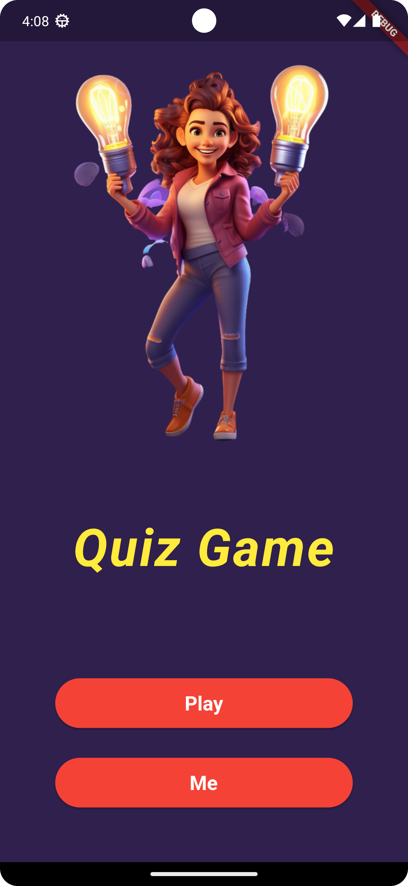
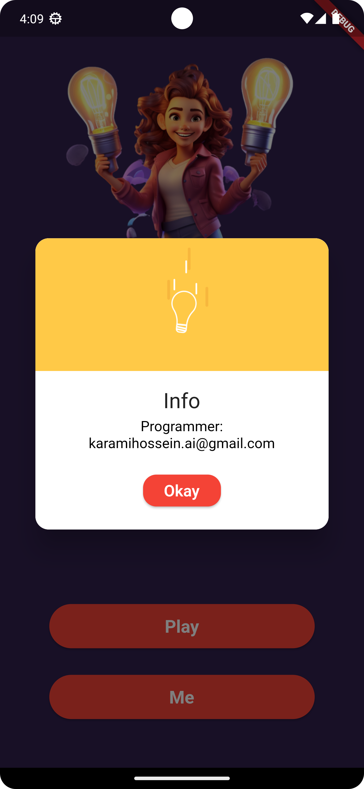
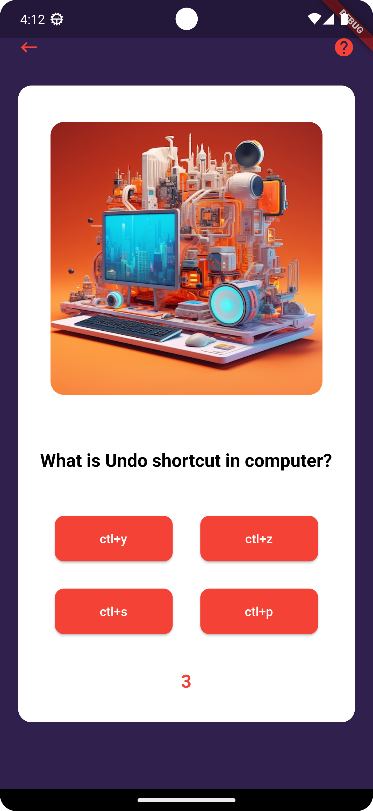
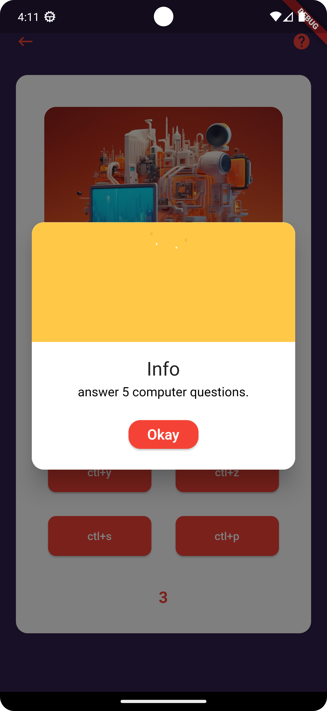
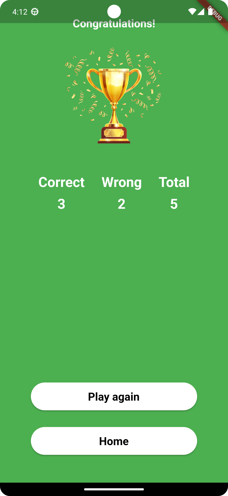

# Quiz Game

local data quiz game.

***

## UI

* Home Page



* Me



* Quiz Page



* Quiz Info



* Win Page



* Lose Page


***

to add new questions, should modify:

```text
Path: quiz_game/lib/quiz.dart
```

    Code: void fetchData() {
    questions = [
      {
        "question": "What is Undo shortcut in computer?",
        "options": ["ctl+y", "ctl+z", "ctl+s", "ctl+p"],
        "answer": 1
      },
      {
        "question": "What is Redo shortcut in computer?",
        "options": ["ctl+y", "ctl+z", "ctl+s", "ctl+p"],
        "answer": 0
      },
      {
        "question": "which is not a program language?",
        "options": ["python", "dart", "html", "typescript"],
        "answer": 2
      },
      {
        "question": "flutter's programming language?",
        "options": ["python", "dart", "swift", "java"],
        "answer": 1
      },
      {
        "question": "backend python framework?",
        "options": ["flask", "fast api", "django", "all"],
        "answer": 3
      }
    ];

